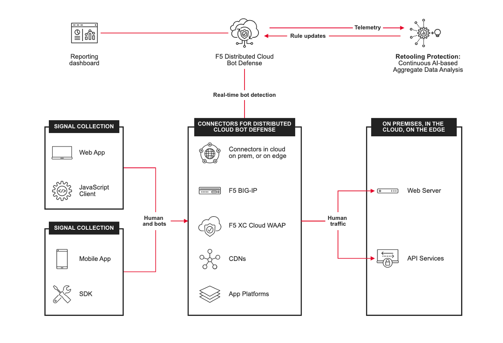
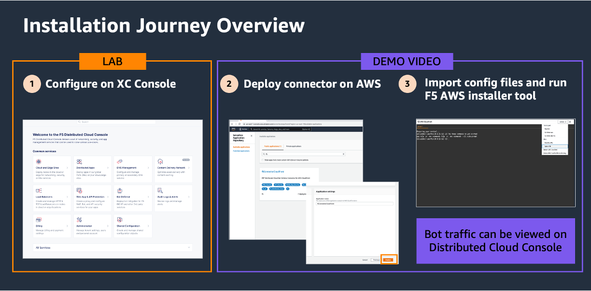
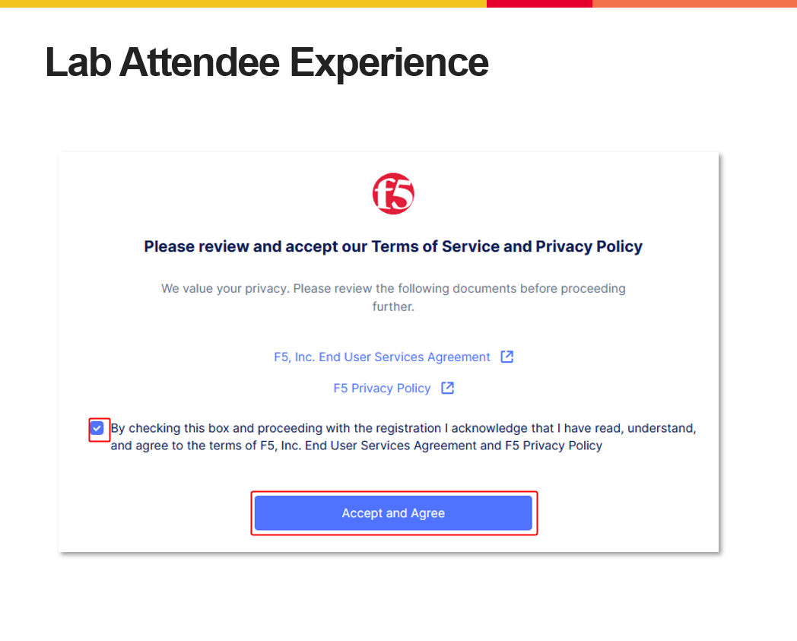
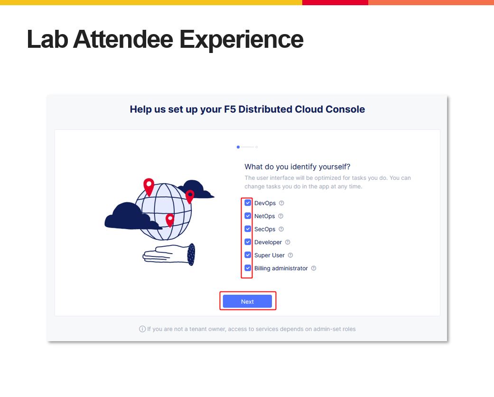
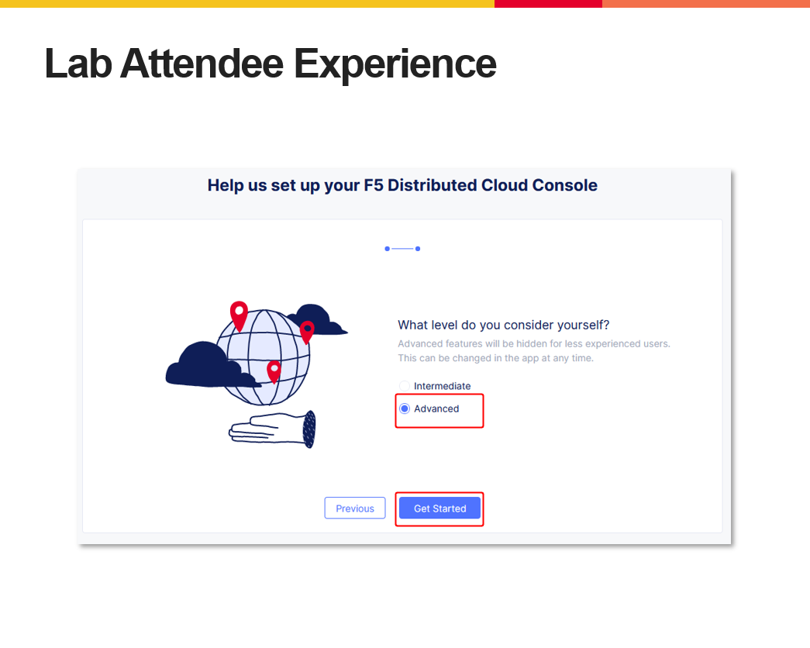
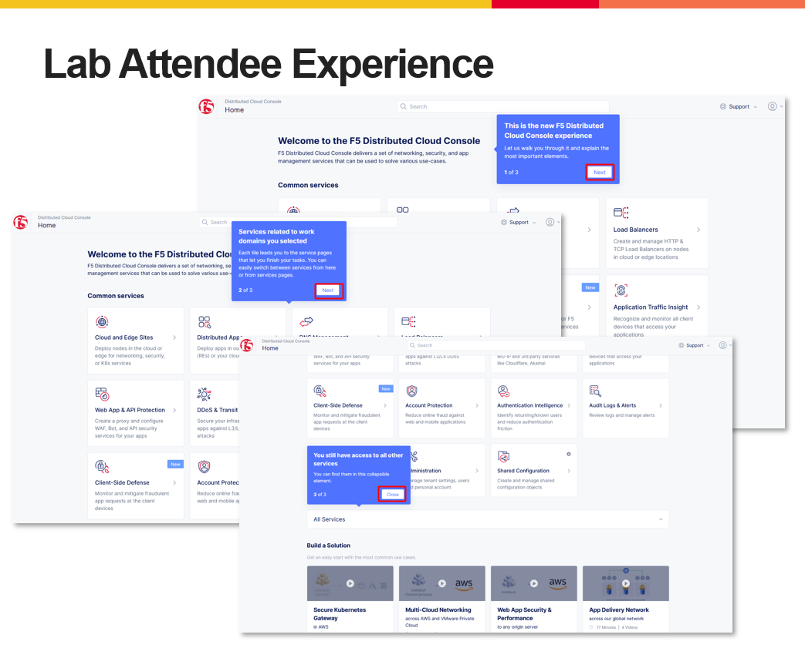

Introduction: Accessing F5 Distributed Cloud Console
====================================================

Welcome to this F5 Distributed Cloud Lab. The following tasks will guide you through the initial 
access requirements for this multi-part lab.  Lab attendees should have received an invitation 
(which requests you update your password for access) email to the lab environment. Please check 
the email address used for course registration and its associated spam folders to see if the
invitation email has been received.  If you have not received an email, please contact a member
of the lab team.
 
The F5 Distributed Cloud Console, where a majority of all lab tasks will be conducted, is a SaaS
based control-plane for services which provides a GUI and API for managing network, security, and
compute services. The F5 Distributed Cloud Console can manage "sites" in existing on-premises,
private data centers and sites within AWS, Azure, and GCP public cloud environments.

Task 1: Lab Environment
~~~~~~~~~~~~~~~~~~~~~~~

+----------------------------------------------------------------------------------------------+
The image below shows an overview of the Distributed Cloud Bot Defense connector integration 
methods.                           

|intro_arch| 

In this lab, we will be demonstrating how to configure the connector for Amazon CloudFront CDN. 
While the majority of the lab will be in the Distibuted Cloud (XC) Console, there will be a short demo 
video on finding and deploying the connector, and uploading the configuration files recently created in 
this lab session. 
                                                                                                                                        
 |Intro_overview| 
 
+----------------------------------------------------------------------------------------------+

Task 2: F5 Distributed Cloud Console Login
~~~~~~~~~~~~~~~~~~~~~~~~~~~~~~~~~~~~~~~~~~

The following will guide you through the initial Lab environment access within the F5 Distributed
Cloud Console.  You should have received an email with an invitation to access a F5 Distributed
Cloud Tenant. The email will come from **no-reply@volterramails.io**.

The name of the F5 Distributed Cloud tenant that we will be using for this lab is **f5-xc-lab-sec**
Additionally, the following are key configuration elements for this lab and will be used
throughout the lab tasks that follow.

* F5 Distributed Cloud Console: https://f5-xc-lab-sec.console.ves.volterra.io/
* Delegated Domain: **lab-sec.f5demos.com**

After following the invitation email's instructions to **Update Password**, proceed to the first
step below to access the F5 Distributed Cloud Lab Tenant. 

+----------------------------------------------------------------------------------------------+
| 1. Please log into the F5 Distributed Cloud Lab Tenant with your user ID (email) & password. |
|                                                                                              |
|    https://f5-xc-lab-sec.console.ves.volterra.io/                                            |
|                                                                                              |
| 2. When you first login, accept the Lab tenant EULA. Click the check box and then click      |
|                                                                                              |
|    **Accept and Agree**.                                                                     |
|                                                                                              |
| 3. Select all work domain roles and click **Next** to see various configuration options.     |
|                                                                                              |
|    Roles can be changed any time later if desired.                                           |
|                                                                                              |
| 4. Click the **Advanced** skill level to expose more menu options and then click **Get**     |
|                                                                                              |
|    **Started** to begin. You can change this setting after logging in as well.               |
|                                                                                              |
| 5. Several **Guidance ToolTips** will appear, you can safely close these as they appear.     |
+----------------------------------------------------------------------------------------------+
| |intro002|                                                                                   |
|                                                                                              |
| |intro003|                                                                                   |
|                                                                                              |
| |intro004|                                                                                   |
|                                                                                              |
| |intro005|                                                                                   |
+----------------------------------------------------------------------------------------------+

+----------------------------------------------------------------------------------------------+
| **Beginning of Lab:**  You are now ready to begin the lab, Enjoy! Ask questions as needed.   |
+----------------------------------------------------------------------------------------------+
| |labbgn|                                                                                     |
+----------------------------------------------------------------------------------------------+

.. |labbgn| image:: images/labbgn.png
   :width: 800px
