Lab 1: Building the F5 Distributed Cloud Bot Defense for Amazon CloudFront CDN
=========================================================================================

Lab 1 will focus on the deployment and configuration of the F5 Distributed Cloud Bot Defense for Amazon CloudFront CDN.
These steps will leverage the F5 Distributed Cloud console and resources delivered via AWS CloudFront CDN. You will begin
this lab from the F5 Dsitributed Cloud main services dashboard.

|lab1-001|

Task 1: Create a new Bot Defense application for AWS CloudFront
~~~~~~~~~~~~~~~~~~~~~~~~~~~~~~~~~~~~~~~~~~~~~~~~~~~~~~~~~~~~~~~
1. Go to the Dashboard page of XC console and click **Bot Defense**.

|lab1-002|

2. Click **Add Application** at the top-left of the page. If no applications exist, a prompt appears about adding a protected application.

|lab1-003|

3. Add a **Name** for the Application, and a **Description**.
4. Select a **Region** (US, EMEA, or APJC).
5. For **Connector Type**, select *AWS CloudFront*. Once *AWS CloudFront* is selected, options appear to configure AWS reference details.

|lab1-004|

Task 2: Add AWS Reference Information
~~~~~~~~~~~~~~~~~~~~~~~~~~~~~~~~~~~~~
1. Enter your AWS 12-digit account number. F5 gives you account access to the F5 Distributed Cloud (XC) Bot Defense connector on your AWS Serverless App Repository (SAR).

|lab1-005|

2. Specify your AWS Configuration and add your CloudFront distribution; a **Distribution ID** and/or a **Distribution Tag**. You can add one or more distributions. This information is needed to associate your newly created protected application to your AWS distribution(s).

|lab1-007|

Task 3: Add Protected Endpoints
~~~~~~~~~~~~~~~~~~~~~~~~~~~~~~~
1. Click **Configure** to define your protected endpoints.
  
|lab1-008|

2. Click **Add Item**.

|lab1-009|

3. Enter a name and a description to the specific endpoint.

|lab1-010|

4. Specify the **Domain Matcher**. You can choose any domain or specify a specific host value.
5. Specify the path to the endpoint (such as /login).
6. Specify a **Query** parameter, if needed. If a **Query** value is defined, the Bot Defense service looks at the **Path** and **Query** values.
7. Choose the **HTTP Methods** for which request will be analyzed by Bot Defense. Multiple methods can be selected.

|lab1-011|

8. Select the type of client that will access this endpoint (such as web only).

|lab1-012|

9. Select the mitigation action to be taken for this endpoint:
  * **Continue** (request continues to origin). You can choose to add a header to requests going to the origin for reporting purposes. Header definition is on next screen.
  * **Redirect​**. Provide the appropriate Status Code and URI
  * **Block**. Provide the Status Code, Content Type, and Response message

|lab1-012|
|lab1-013|
|lab1-014|
|lab1-015|
  
10. When done configuring the endpoint, click **Apply**.
11. Your protected endpoint is added to the table. The **Actions** column allows you to modify the endpoints. You can add additional new endpoints via the **Add Item** button.
12. To continue, click **Apply** at the bottom of the page.

|lab1-016|

Task 4: Define Continue Global Mitigation Action
~~~~~~~~~~~~~~~~~~~~~~~~~~~~~~~~~~~~~~~~~~~~~~~~
The **Header Name for Continue Mitigation Action** field is the header that is added to the request when the **Continue** mitigation action is selected and *Add A Header* was selected in the endpoint mitigation configuration screen.

|lab1-017|

Task 5: Define Web Client JavaScript Settings
~~~~~~~~~~~~~~~~~~~~~~~~~~~~~~~~~~~~~~~~~~~~~
1. Add the **Web Client JavaScript Path**. You should select paths to HTML pages that end users are likely to visit before they browse to any protected endpoint. **Web Client JavaScript Settings** is relevant only if you have web protected endpoints.

|lab1-018|

2. For the **Web Client JavaScript Insertion Settings** field, select to Specify the JS Insertion Rules or to Manually insert the JS tags (Advanced Fields needs to be turned on to view this option. Follow instruction in Advanced Features Settings).
3. **JS Location** - Choose the location where to insert the JS in the code:
  * Just After <head> tag.
  * Just After </title> tag.
  * Right Before ​

I/O Hook JavaScript​
-------------------
.. code-block
   ​

Replace *INJECTION PATH* with the value you specified for Web Client JavaScript Path.

Task 8: Advanced Fields:Trusted Client Rules (Allow List)
~~~~~~~~~~~~~~~~~~~~~~~~~~~~~~~~~~~~~~~~~~~~~~~~~~~~~~~~~

Trusted Client Rules adds headers and IP addresses to an Allow List. Pages with a specific IP or containing specific headers are allowed to proceed to the origin. No logging is done on pages that are on the allow list.
Multiple headers can be added to the table and saved. IP Addresses need to be added individually.  

1. In the **Trusted Client Rules** field, click **Configure**.
2. Click **Add Item**.
3. Enter a Name and specify the **Client Identifier**. Choose either *IP Address* or *HTTP Header*.
  * For *IP Prefix*, enter a string.
  * For *Header*, enter a Name and value.

Task 9: Advanced Fields:Time out and Body Sample Size Limit
~~~~~~~~~~~~~~~~~~~~~~~~~~~~~~~~~~~~~~~~~~~~~~~~~~~~~~~~~~~

* Timeout - defines the max time to send the requests to the Bot Defense Engine for analysis. If the timeout is exceeded, the request will continue to the origin (this is tracked in AWS CloudWatch). By default, the field is set to 700ms based on performance efficiency.
* Body Sample Size - allows for additional request body data (other than F5 telemetry) to be sent for analysis. By default, this is set to 0 MB. Max size limit is 1MB.

Task 10: View Traffic
~~~~~~~~~~~~~~~~~~~~~

After your configuration has been added, navigate to **Monitor**. You can view all traffic that the F5 XC Defense Engine has recorded, for valid and invalid requests.
This tool can help analyze thousands or millions of requests.

Task 11: AWS Console
~~~~~~~~~~~~~~~~~~~~

1. Login to AWS Console home page.
2. Select AWS Region Northern Virginia (US-EAST-1).
3. Use the search to find Serverless Application Repository and click it.
4. Click Available Applications.
5. Click Private Applications.
6. Click the f5ConnectorCloudFront tile.
  * If there are too many tiles here, you can search for f5.
  * If the F5 connector tile does not appear, validate the AWS Account number provided to F5.
7. Click Deploy to install the F5 Connector for CloudFront.

Deploying the F5 Connector creates a new Lambda Application in your AWS Account. AWS sets the name of the new Lambda Application to start with *serverlessrepo-*.

The deployment can take some time. It is complete when you see the **f5ConnectorCloudFront** of type **Lambda Function**.

You can click on the name **f5ConnectorCloudFront** to review contents of the installed Lambda Function.

Configuration of the F5 Connector in AWS is best done via the F5 CLI tool. It is recommended to use the AWS CloudShell.
1. After starting AWS CloudShell, click **Actions** and **Upload file**.
2. Upload the files you downloaded from the F5 XC Console, **config.json** and \*f5tool.
3. Run bash *f5tool -install config.json*. Installation can take up to 5 minutes.

The installation tool saves the previous configuration of each CloudFront Distribution in a file. You can use the F5 tool to restore a saved Distribution config (thus removing F5 Bot Defense).

.. note:: 
   Note: Your F5 XC Bot Defense configuration, such as protected endpoints, is sensitive security info and is stored in AWS Secrets Manager. You should delete config.json after CLI installation.

Task 11: AWS CloudWatch
~~~~~~~~~~~~~~~~~~~~~~~

AWS CloudWatch contains logs for Lambda function deployed by **f5ConnectorCloudFront** serverless application.
The Log group name starts with */aws/lambda/us-east-1.serverlessrepo-f5ConnectorCl-f5ConnectorCloudFront-*.
The logs of lambda function can be found in the region closest to the location where the function executed.

For troubleshooting, look for error messages contained in the links under Log steams.

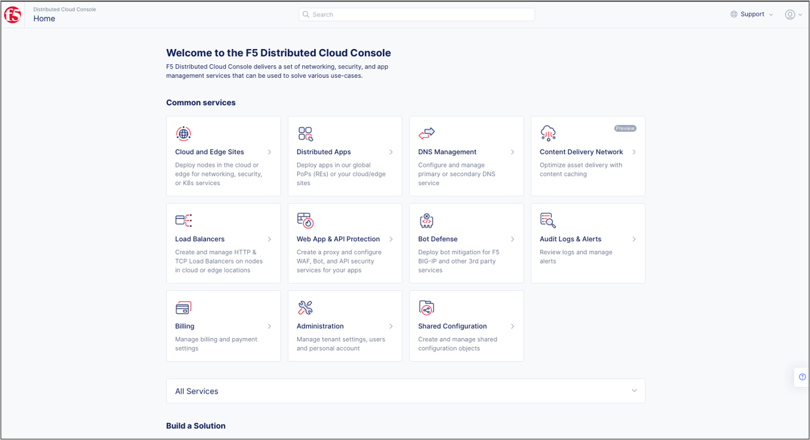
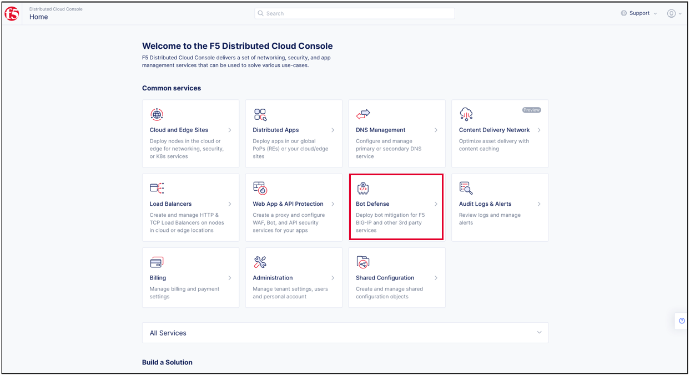
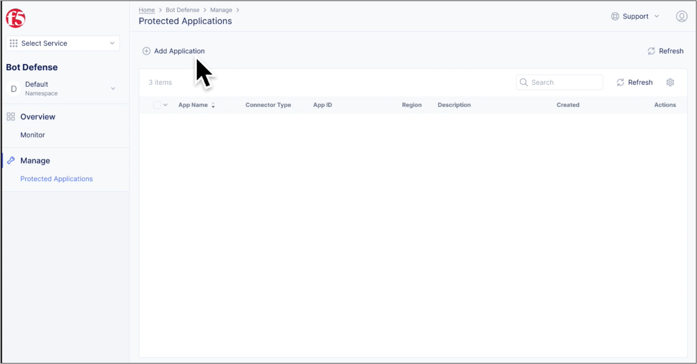
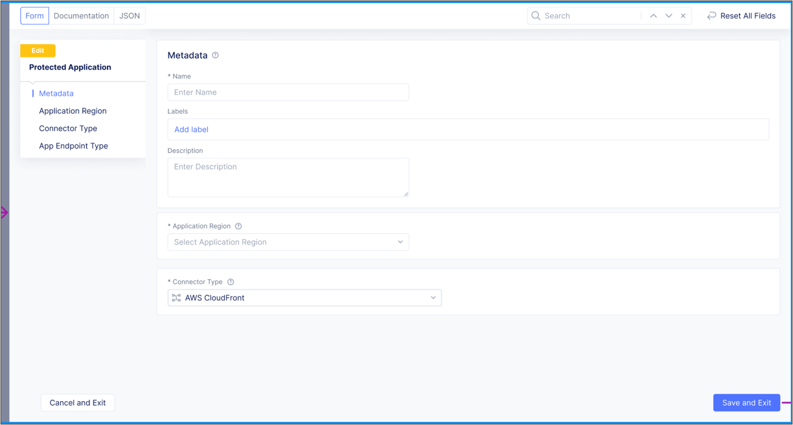

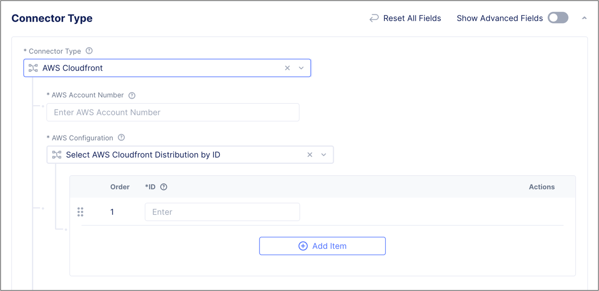
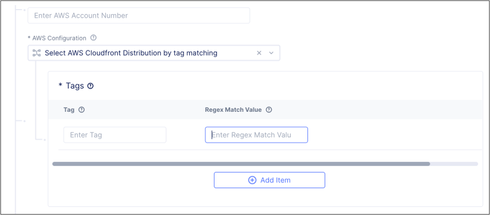
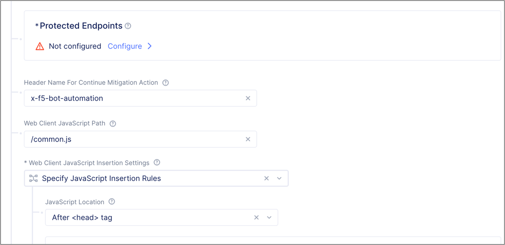
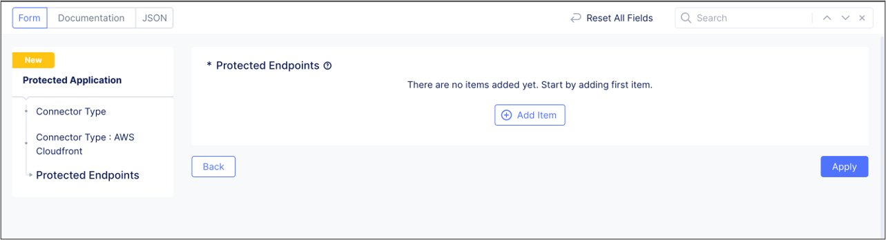
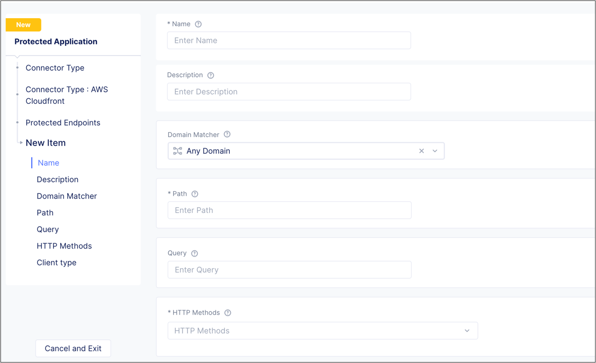
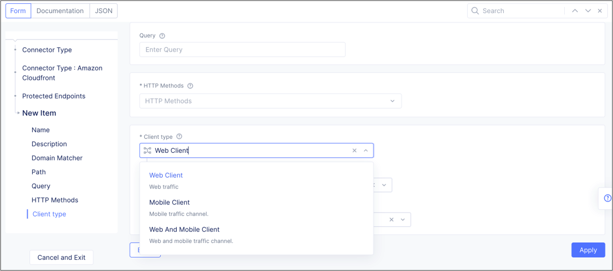
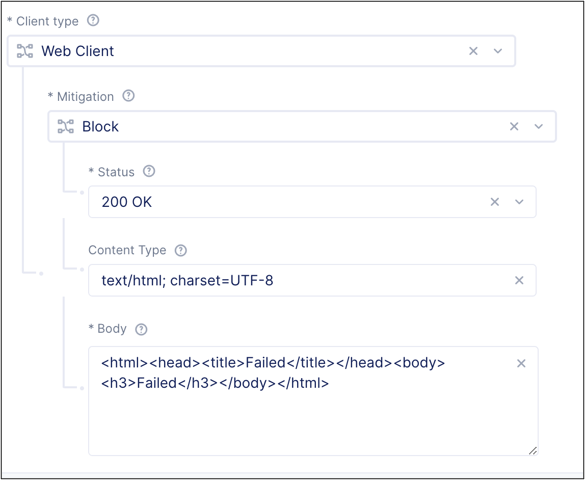
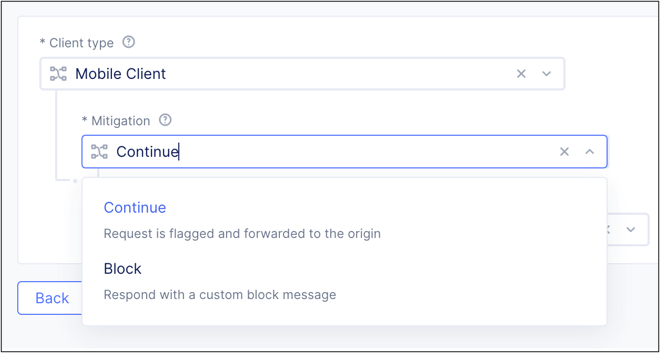
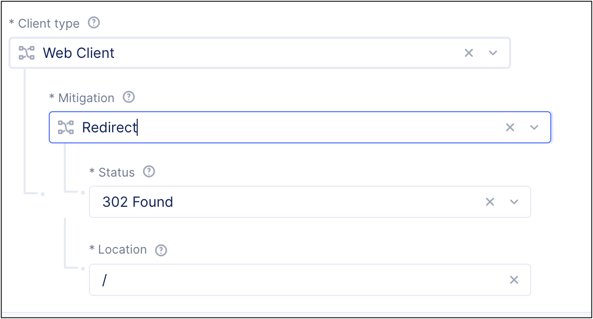
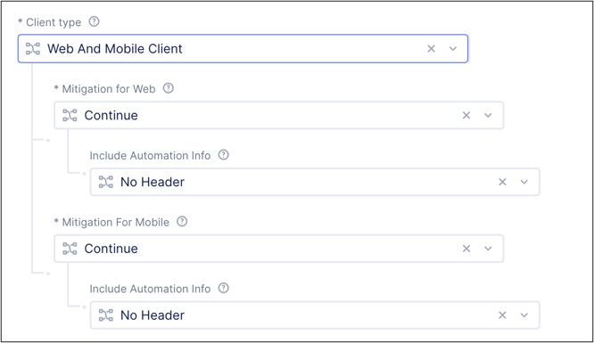
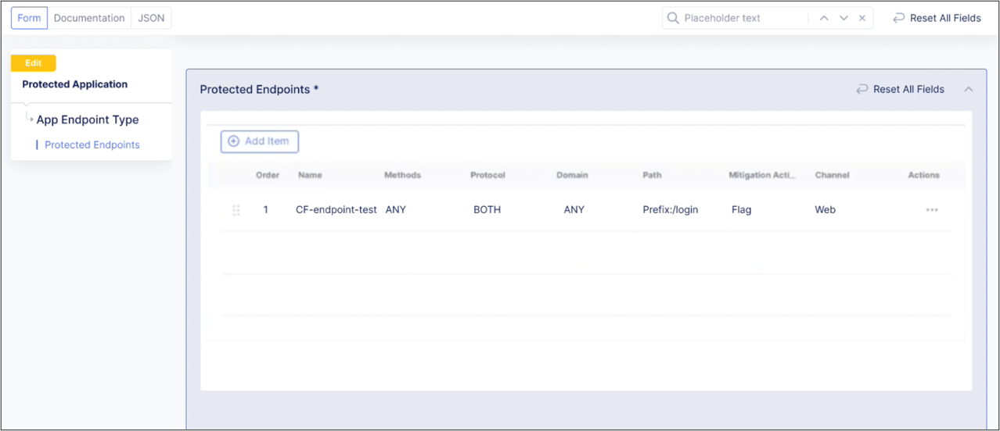
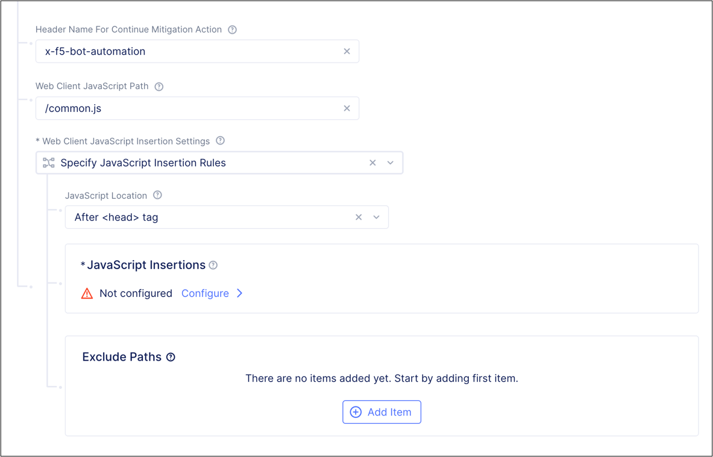

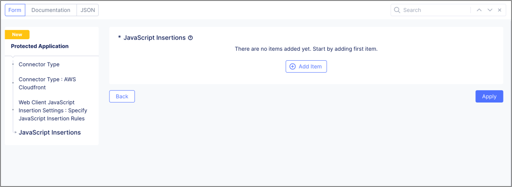
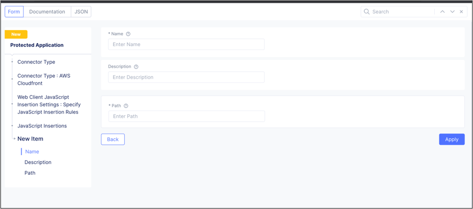
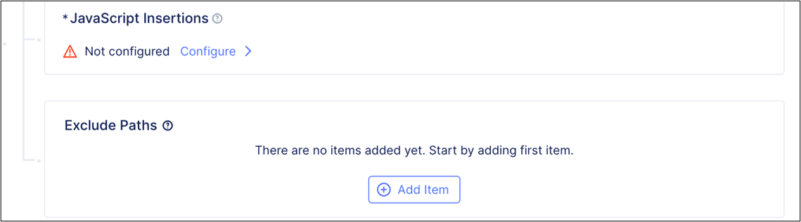
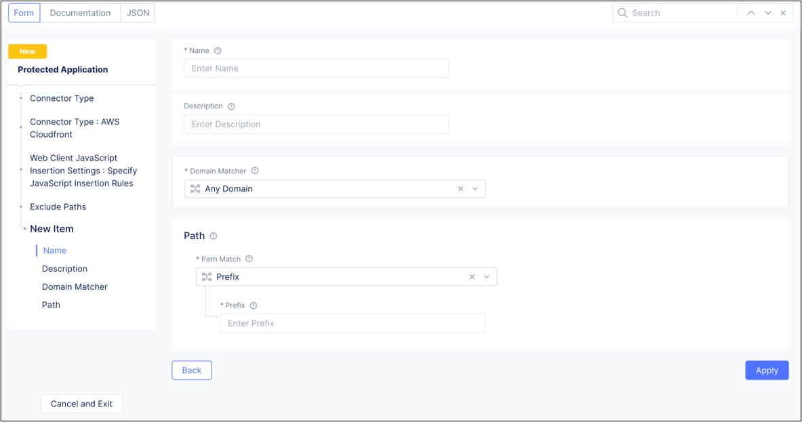
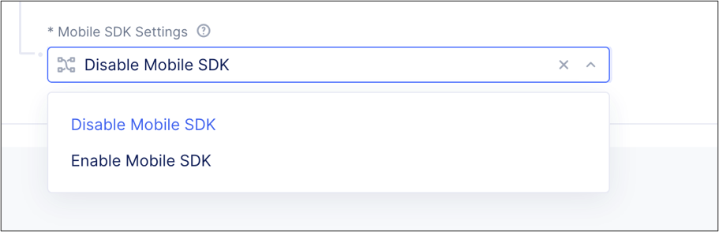
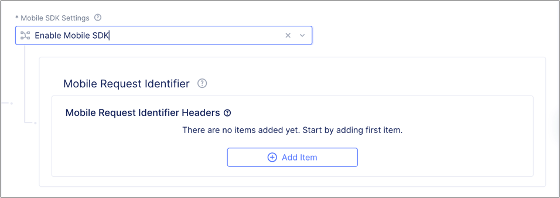
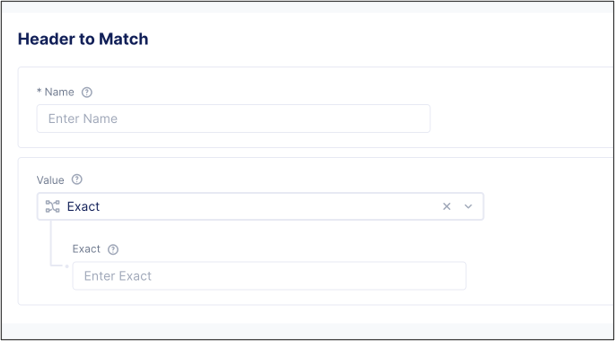
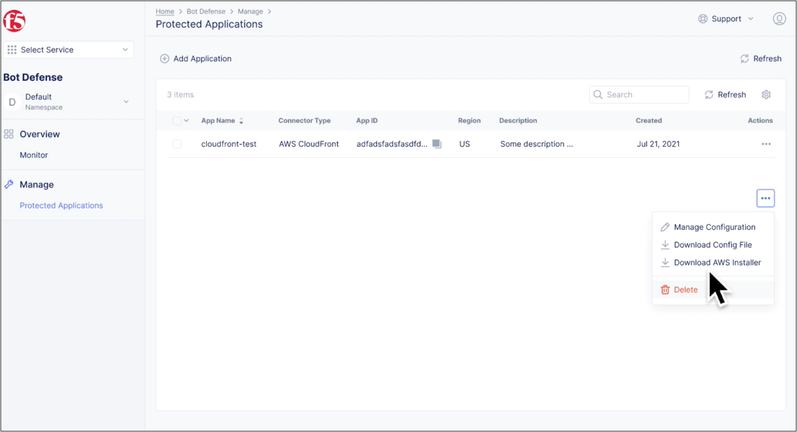
